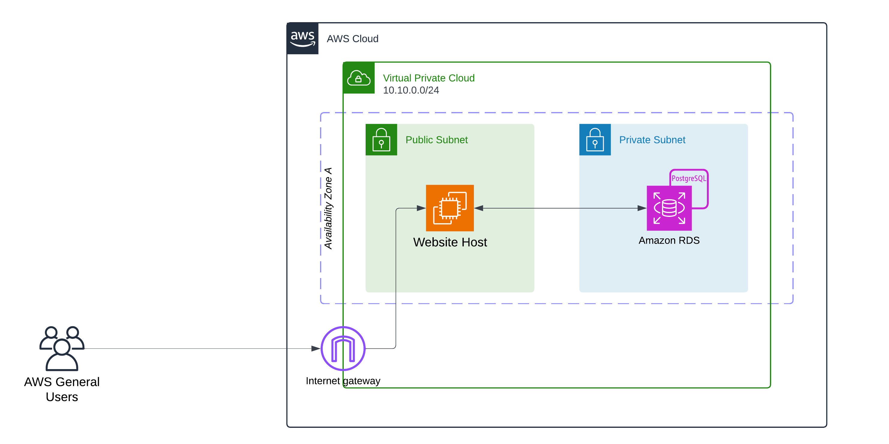
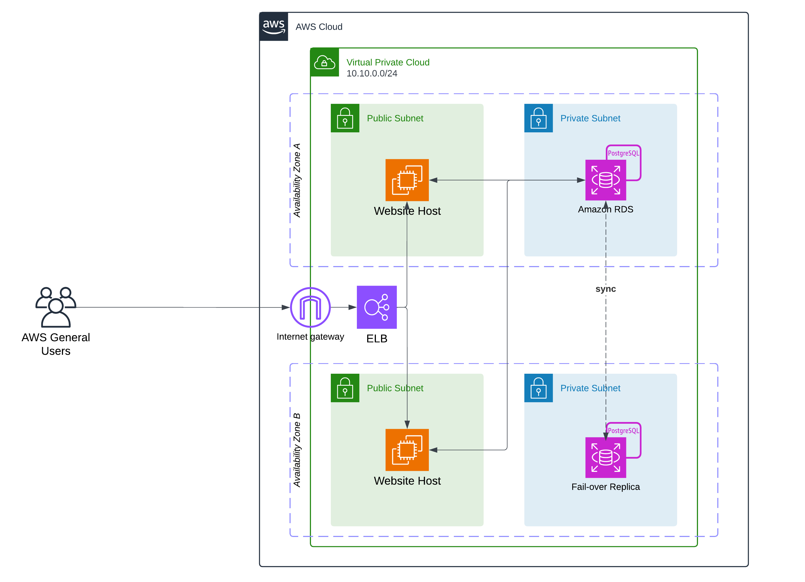
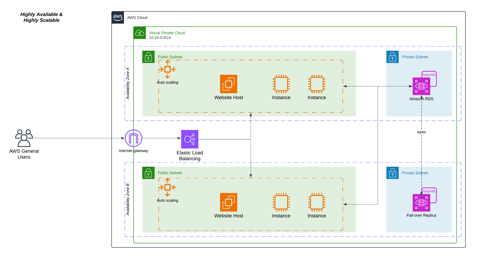

# cep-1-simple-app
Cloud Engineering Project 1 - Simple web app using AWS architecture

## TL;DR

### Learnings
tbd

### Future work
tbd


## Short Description
This project features a simple web app UI that facilitates CRUD operations with a database and displays the results correctly.


## Goal of this Project
- create simple architecture diagram leveraging AWS services
- setup 3 basic layers for a simple web app: (1) application layer, (2) networking layer, and (3) persistence layer
- learn how to setup and connect basic AWS services (compute + storage)
- learn about availability and scalability and how this can be achieved in AWS
- document steps and learnings along the way


## Intended Steps (plan)
- research AWS components suitable for this project (S3, RDS, ...)
- learn about highly available and scalable applications in AWS
- draw an architecture diagram
- find a suitable simple app concept that facilitates CRUD operations with the persistence layer
- implement the achitecture in AWS (console)
- test the implementation
- document all relevant steps and learnings


## Phase 1 - Research
The research for this project explores the following areas: (i) hosting of an application (static vs. dynamic), (ii) storage, (iii) required networking (and security best-practices), (iv) the concepts of availability and scalability and how they can be applied to this project. Within each area, I will explore potential options and their suitability / trade-offs for this project.

### 💻 App Hosting
For hosting app (content) we need to distinguish two important concepts to determine the right hosting environment: (1) static website, and (2) dynamic website.

#### Static website
A static website contains only consists of up to 3 main files (`.js`, `.html`, and `.css`) that generate the webpage. Static does not mean that the website itself won't change. It means that the website's content is not created dynamically on the server-side. However, the content, generally, does not change frequently.

For static websites AWS offers a simple and cost-effective way of hosting it: through S3 bucket directly (static hosting).

#### Dynamic website
A dynamic website is generated "on-the-fly", meaning on the server-side at runtime. Whenever content on the webpage is generated dynamically - e.g. calls to an API and results are displayed, calls to a database - then it needs different hosting.

For dynamic websites AWS offers compute (**EC2**) resources that run the website content.


> [!NOTE]
> For this project we will use a **dynamic website** that can query and update database content.

> [!TIP]
> The database access can also be realized with a static website using cloud functions (Lambda) or calling the API of a backend that does the query work. The latter is a bit over the top for this minimal application. Using a Lambda function could be an interesting change to explore from both, a functionality perspective and a cost perspective. (Lambda functions are paid by execution)


### 💾 Storage
As a storage option I will explore AWS's **RDS** (relational database service) to spin up a basic PostgreSQL database. Next to being fully managed by AWS (i.e. patches, updates, recovery, etc.), an advantage relevant to this project it the possibility to set up fail-over databases. This means a separate instance of the same DB is created in a different availability zone (AZ) and synchronized with the main database. In case that the main DB fails (e.g. adverse climate), the connection gets switched to the failover DB and served from there until AZ1 becomes available again. This ensures high availability.

Additionally, it is possible to add _auto-scaling_ to an RDS database to dynamically add storage capacity when nearing the end of the current free space. This can be controlled setting a maximum threshold. Auto-scaling, obviously, can ensure the scalability of the storage component of this architecture.


### 🌐 Networking (and Security)
This project broadly needs to accomplish two things: (1) host a simple application in an open space, and (2) host a database that the application can connect to to perform basic CRUD operations. The application should be accessible from the internet (HTTP/HTTPS), whereas, for security reasons, the database should only be accesbile to the application itself (TCP❓). 

To accomplish this, I will set up a Virtual Private Cloud (**VPC**) with two **subnets**: one public (app), and the other private (db). The public subnet will require an **Internet Gateway** (set up automatically) to be able to communicate with the internet. 
To facilitate the communication I will set up **Security Groups** that allow the accesses as described above.

#### RFC1918 - private addresses
Today I learned that there are certain CIDR blocks defined as "private" addresses according to [RFC1918](https://datatracker.ietf.org/doc/html/rfc1918):
- 10.0.0.0/16 -> ~16.7 mil. available IPs; used for large scale projects
- 172.16.0.0/12 -> ~1 mil. available IPs; used for medium scale projects
- 192.168.0.0/8 -> ~65k available IPs; used for small scale projects

This is important to know because a subnet's **routing table** will disregard addresses that fall under these CIDR blocks if not specifically instructed. In other words, even if the "all encompassing" `0.0.0.0/0` appears in the routing table, a package destined for a private CIDR block will be dropped (if it's not VPC internal traffic).

> According to this, I would chose the `192.168.0.0/8` CIDR block for this project, as it is a small scale project (for now) and it might make route handling easier for this learning experience.

### Availability & Scalability

#### Availability
An application/service is **highly available** if it can be served by some instance (at all times). 

For example, **AWS's RDS** (relational database service) provides several features that can ensure high availability of the service (in this case the access to a database):
- *multi-AZ* (availability zone) creation --> creates an additional instance in a different AZ to provide automatic failover in case something happens to the main instance.
- *read-replica* --> creates 1 (or more) copies of the database in the same or different AZ or even a different region. This eleviates read traffic from the main database instance. Replicas are asynchronously updated and synced with the main database to ensure they contain up-to-date data

#### Scalability
Refers to horizontal or vertical scaling of a service. **Horizontal scaling** means adding more instances of the same service (e.g. EC2 instances) to deal with the workload. **Vertical scaling** means an instance increases/decreases its performace internally (e.g. switching the EC2 type to a more powerful one).

#### Auto-scaling groups
AWS's **EC2** component offers another feature that offers both, availability, and scalability: _auto-scale groups_ (ASGs). An ASG allows to automatically spawn and re-spawn (in case of instance failure / unhealthiness) compute instances based on the configuration. This can happen in a single or multiple subnets, i.e. in a single or multiple AZs.

For ASGs the following needs to be available / specified:
- a template for compute instances (AMI - Amazon Machine Image) -> this will be the blueprint for each new instance launched
- subnets to provide component in
- min, desired, and max number of instances
- a **load balancer** to route traffic to the instances (!)


## Phase 2 - Architecture Design
For the architecture I created three different views: (1) a basic design to realize only the functionality for this project, (2) a design that is highly available, and (3) a design that is highly available and highly scalable.

> [!IMPORTANT]
> For the purpose of this project, I will implement a version of all three, designs 1, 2 and 3. I hope to gain relevant experience dealing with high availability and scalability in a fairly simple overall project.

For each design I include a **cost estimation** (using the [AWS Pricing Calculator](https://calculator.aws/#/)) for _region Frankfurt_ as a reference. The price point of a design might well impact a decision to realize the architecture or rather pivot to a different setup.

> [!NOTE]
> Most components/services in the 3 designs fall under the free-tier. The cost estimates will be a reference for a live system.


### Basic design


The basic design focuses on functionality only: dedicated VPC with public and private subnet, an Internet Gateway to facilitate access to the outside world, an EC2 instance to host the dynamic website, and an RDS (PostgreSQL) instance to handle the data and CRUD requests.

#### Cost estimation
_Per Dec. 2024_

| Pos. | AWS Service | Assumptions | Price Point (USD per month) |
| :-: | :-- | :-- | :-: |
| 1 | EC2 | 1 instance (t3.medium) <br>100% utilization per month | 37.14 |
| 2 | RDS | 1 instance (20GB storage, single AZ) <br>100% utilization per month<br>25GB backup storage | 23.57 |

Monthly total: **60.71 USD**


#### Pros/cons

| :white_check_mark: Pros | :o: Short-comings |
| :-- | :-- |
| simple design that accomplishes the requirements | no mechanisms to handle potential failure of components |
| recommended isolation of data into private subnet (security) | no user authentication / no separation of user data |
| relatively cheap implementation | no resource handling for downtimes |


### Highly available design


This design includes a redundant EC2 instance in a differt AZ to increase availability as well as a load balancer to ensure traffic can be routed to these instances. The database has a failover instance in a different AZ to ensure availability of data, even if the main instance fails.

#### Cost estimation
_Per Dec. 2024_

| Pos. | AWS Service | Assumptions | Price Point (USD per month) |
| :-: | :-- | :-- | :-: |
| 1 | EC2 | 2 instances (t3.medium) <br>100% utilization per month | 70.08 |
| 2 | RDS | 2 instances (20GB storage, multi-AZ (fail over instance)) <br>100% utilization per month<br>25GB backup storage | 131.76 |
| 3 | Load Balancer | 1 instance ALB <br>30GB per month processed (EC2 targets) | 19.95 |

Monthly total: **221.79 USD**


#### Pros/cons

| :white_check_mark: Pros | :o: Short-comings |
| :-- | :-- |
| design that ensures high availability of the application |  |
| recommended isolation of data into private subnet (security) | no user authentication / no separation of user data |
|  | costs comparable to design 3 with less scalability options |


### Highly available and highly scalable design


This design builds on the previous design but introduces auto scaling groups for the EC2 instances that host the website. This provides scalability to the aplication in case higher traffic occurs or is expected. However, this sophisticated design requires substantial (AWS) resources and may not be a good choice for the simplicity of the application.

#### Cost estimation
_Per Dec. 2024_

| Pos. | AWS Service | Assumptions | Price Point (USD per month) |
| :-: | :-- | :-- | :-: |
| 1 | EC2 | 2 instances (t3.medium) <br>100% utilization per month | 70.08 |
| 2 | EC2 | 4 instance (t3.medium), auto-scale group <br>4h utilization per day | 23.36 |
| 3 | RDS | 2 instances (20GB storage, multi-AZ (fail over instance)) <br>100% utilization per month<br>25GB backup storage | 131.76 |
| 4 | Load Balancer | 1 instance ALB <br>40GB per month processed (EC2 targets + auto-scale instances) | 20.03 |

Monthly total: **245.23 USD**


#### Pros/cons

| :white_check_mark: Pros | :o: Short-comings |
| :-- | :-- |
| sophisticated design for this use case; ensures both, high availability and high scalability | given the simplicity of the application, this is overkill (learning FTW) |
| recommended isolation of data into private subnet (security) | no user authentication / no separation of user data |
| can react to increasing/decreasing traffic | potentially costly |


## Phase 3 - Implementation
Before implementing any of the designs above, I first need to prepare the scripts for a basic app that will use the database capabilities and display some results in an UI.

### Suitable app example
For the basic app I will use a basic trip scheduler that allows to view, create, edit, and delete trips. Trips are displayed to the user accordingly. To achieve this I will need to create the following:

- a basic frontend to display the trips table to the user
- a database that stores the trip information
- a backend that handles requests to the database and forwards the information to the frontend

#### Simple frontend
I am no frontend expert, so I will start off by using a suggestion from ChatGPT. I used the following prompt:

```txt
You are a senior frontend developer.

Write React code for a simple frontend that has the following attributes:
- the app is called "InTown"
- the landing page should display a welcome message and a reference to the AWS server it is served from
- there is only 1 additional page called "Trips"; include appropriate navigation between landing page and "Trips"
- functionality for the Trips page:
  - displays a table of existing trips; table columns are: id, destination, country, trip_start, trip_end, user_notified
  - has functionality to create, edit, delete a trip; all these CRUD operations need to talk to APIs from a backend that already exists
- endpoints of the backend:
  - GET "/trips" --> list of all trips
  - GET "/trips/{trip_id}" --> get one specific trip (if exists)
  - POST "/trips/" --> expects Trip object (compare table columns)
  - PUT "/trips/{trip_id}" --> expects Trip object (compare table columns) with the updated information
  - DELETE "/trips/{trip_id}" --> deletes specific trip (if exists)
- The backend is written in Python using FastAPI

Use an appropriate theme to make it look slick.
```

The suggested implementation can be found in this repo at `src/frontend/...`. Needs to install materia UI:

```bash
npm install @mui/material @emotion/react @emotion/styled axios react-router-dom
```

API integration is handled via `axios`. Might need to adapt BE endpoints.

> [!WARNING]
> The suggested code by ChatGPT was not functional and required both, additional prompts to clarify errors and manual fixes to make it come together with the BE logic. It was, however, a good starting point.


#### Simple backend to handle CRUD operation requests
I set up a simple BE using FastAPI and defined the 4 basic CRUD ops to handle trips. The BE needs to communicate with both the frontend and the database to handle requests effectively.

The code is located at `src/backend/...`.


#### Communication of FE, BE, and DB
The implementation of the networking component will vary depending on the architecture I am implementing. Let's start with the most basic design.


### Design 1 - Basic

#### Connecting to a db and perform queries
To test connecting to an RDS DB, I'm building on example code from the [AWS documentation](https://docs.aws.amazon.com/AmazonRDS/latest/UserGuide/UsingWithRDS.IAMDBAuth.Connecting.Python.html). Ultimately, I need to figure out how to set up the db instance with the db schema that the application needs.

| :pushpin: Action(s) | :mag_right: Observations | :o: Issues |
| :-- | :-- | :-- |
| I created a free-tier test db instance linked to the VPC for this project. | :white_check_mark: Instance created and functional | |
| I tried using the example code to make a connection (from my loacal machine/IDE) to that instance. | :x: Failed to connect. | Potentially missing permissions / access credentials |
| I configured a local config profile with access keys and retried. | :x: Failed to connect. | Potentially missing network permissions |
| I created/configured a security group to allow IP/TCP traffic and linked it to the VPC. Retried the script. | :x: Failed to connect. | Maybe an issue of who tries to connect to the instance? I.e. I expect the db instance to be located in a private subnet of the VPC and to my knowledge no external (to AWS) entity would be allowed to access. Checking rds instances with AWS CLI `aws rds describe-db-instances` it states that public access is denied. |
| Next, I created a EC2 instance, set up a connection to the db and tried to SSH into the instance to verify the connection. | SSH connection continuously timed out even though security group rules are in place. The EC2 instance has no public IP for now. | Missing public IP address prohibits the SSH access (my understanding). |
| Recreated an EC2 instance with public IP, set up connection to the db and try the same. | :white_check_mark: EC2 instance with public IP created<br>:white_check_mark: SSH access to EC2 worked<br>:white_check_mark: Connection to RDS worked | --- |


Commands to connect to db:

Installing psql inside the EC2 instance (amazon linux image):
```bash
sudo yum update
sudo yum search "postgres"
sudo yum install postgres16 -y # corresponds with the engine in RDS
```

Connecting to RDS instance:
```bash
psql -h <db-endpoint> -U <user-name> -d <db-name> -p <port>
```
_Note_: if nothing is set up, use `postgres` as a default db-name.


#### Setting up RDS with db schema
The RDS instance I had setup previously did not contain the desired db schema for the simple app (nor did it include any sample data to play with later). I could set that up manually in the previous step (SSH into EC2, connect to RDS, create database and schema). However, for obvious reasons I don't want to do it that way (manual, cumbersome, error-prone, not automated). Hence, I am looking now into setting up a db instance that is pre-configured with the db schema (and sample data) that I need.


| :pushpin: Action(s) | :mag_right: Observations | :o: Issues |
| :-- | :-- | :-- |
| Researching how I can achieve the db instance being setup with the right schema (and sample data) automatically. | - need a database dump (can be stored in S3)<br>- can use an EC2 instance to trigger the configuration within an existing RDS instance. |  |
|  |  |  |


EC2 start-up script for DB config:

tbd


> [!IMPORTANT]
> The degree of automation seems still somewhat limited (e.g. need to manually setup the RDS instance). In a future iteration, I will work on using IaC (TerraForm) to accomplish a fully automated setup of the infrastructure. Also, containerization seems to be able to simplify a couple of things in this setup.


#### :bulb: Learnings:
- connecting to an EC2 instance **without public IP** is more cumbersome and needs additional setups --> I will explore this for the other designs, as they naturally involve architecture that is required (e.g. elastic load balancer)
- ensure that EC2 and RDS are **located in the same VPC** to connect
- always ensure the **proper security group rules** are in place


## Phase 4 - Testing
tbd


## Limitations & Potential Next Steps
tbd
